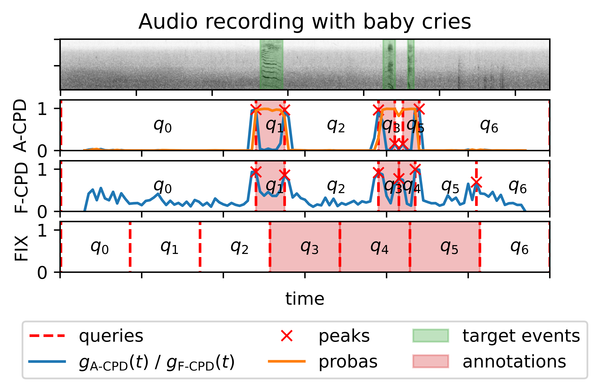

# From Weak to Strong Sound Event Labels using Adaptive Change-Point Detection and Active Learning

TODO: add primary method image
TODO: remove or move unused scrips, currently you have to scroll for the README.

A repository containing an annotaion framework for bioacoustics

# Produce figures and tables
    # download the experiments
    # TODO
    wget <zenodo>/results_eusipco_2024.zip
    unzip results_eusipco_2024.zip

    # produces all tables in the paper
    python tables.py

    # produces all figures in the paper
    python figures.py

The figures in

    ./results/figures

Have now been overwritten with figures derived directly from the results

# Run experiments on the used data
This section explains how to reproduce the EUSIPCO 2024 results, they will be put in the directory

    results/eusipco_2024_reproduced

## Download data and pre-computed embeddings

    git lfs clone https://github.com/johnmartinsson/adaptive-change-point-detection.git

The data and the pre-computed embeddings will now be in

    ./data/embeddings_and_labels.zip
    cd ./data
    unzip embeddings_and_labels.zip

This is the minimum requirement to run the simulations.

## Setup environment

    pip3 install torch torchvision torchaudio --index-url https://download.pytorch.org/whl/cu118
    pip3 install -r requirements.txt

## Run experiments

    python main.py

The results of the experiment will be in

    ./results/eusipco_2024

## Produce figures and tables

Please update the config.py script after this and change

    results_dir : eusipco_2024 # to
    results_dir : eusipco_2024_reproduced

Then produce the figures and tables in the same way as described above. If you do not change this line, the produced figures and tables will be from the uploaded eusipco_2024 results.
